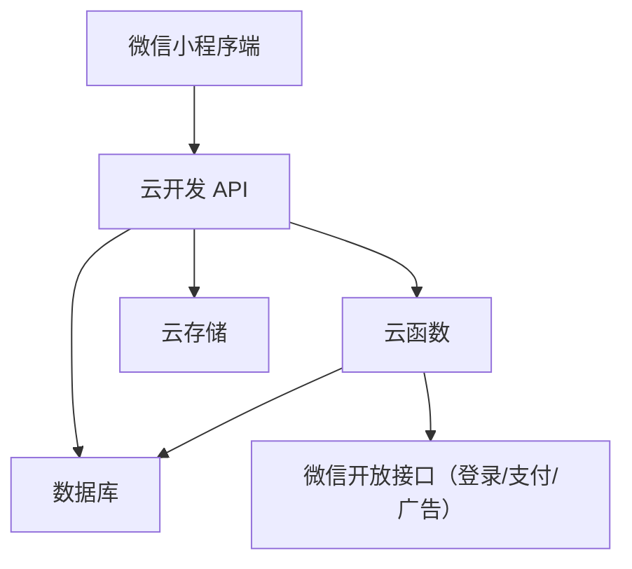

# 技术文档：成语碎片拼合游戏（微信小程序）

| 版本 | 日期 | 作者 | 变更内容 |
|------|------|------|----------|
| V1.0 | 2026-05-09 | 技术团队 | 初版 |

## 1. 技术选型与推荐理由

| 模块 | 技术栈 | 推荐理由 |
|------|--------|----------|
| 前端 | 微信小程序原生框架 (WXML + WXSS + TypeScript) | 性能最优，支持拖拽、动画等复杂交互；云开发集成度高 |
| 后端 | 微信云开发 (CloudBase) | 无需自建服务器；自动伸缩；提供数据库、云函数、云存储、调用微信开放能力 |
| 数据库 | 云开发 JSON 数据库 | 与前端 API 无缝对接；实时推送能力 (watch) 可用于排行榜 |
| 云函数 | Node.js 12 / 16 | 实现成语校验、关卡解锁、积分计算等逻辑，保证安全性 |
| 存储 | 云存储 | 存放关卡配置 JSON、用户头像等 |
| 监控 | 微信小程序后台 + 云开发日志 | 实时查看错误、性能、访问统计 |

> 备选：如需自建后端，可用 Node.js + Express + MongoDB + Redis（会话/缓存），但云开发更轻量。

## 2. 系统架构图



- **小程序端**：负责界面渲染、用户交互、本地缓存（关卡进度）。
- **云函数**：处理核心逻辑：关卡数据读取、碎片放置校验、体力/积分变更、通关检测、提示扣费等。
- **数据库**：存储用户信息、关卡元数据、用户进度、排行榜等。
- **云存储**：存储关卡 JSON 配置文件（便于热更新）。

## 3. 数据库集合设计

### 3.1 `users` 集合
| 字段 | 类型 | 说明 |
|------|------|------|
| _id | string | 微信 openId |
| nickName | string | 用户昵称（从微信获取） |
| avatarUrl | string | 用户头像 |
| level | number | 当前已解锁最高关卡（默认1） |
| totalScore | number | 总积分 |
| stamina | number | 当前体力值（上限10） |
| lastStaminaRecover | Date | 上次体力恢复时间戳 |
| createdAt | Date | 注册时间 |
| updatedAt | Date | 更新时间 |

### 3.2 `level_config` 集合（关卡静态配置）
| 字段 | 类型 | 说明 |
|------|------|------|
| _id | number | 关卡号（1~N） |
| rows | number | 网格行数 |
| cols | number | 网格列数 |
| fixedCells | array | `[{row,col,char}]` |
| idioms | array | `[{direction, row/col, startCol/startRow, endCol/endRow, answer}]` |
| fragments | array | `[{text, length, positions:[[row,col],...]}]` |
| distractors | array | 干扰碎片 `[{text, length}]` |
| minScore | number | 通关奖励基础积分 |
| difficulty | string | easy/medium/hard |

### 3.3 `user_progress` 集合（记录每个关卡的用户填字状态）
| 字段 | 类型 | 说明 |
|------|------|------|
| _id | string | 自动生成 |
| openId | string | 用户标识 |
| levelId | number | 关卡号 |
| gridState | array | 二维数组，存储每个格子的当前字符（固定+用户填入）或null |
| usedFragments | array | 已使用的碎片文本列表 |
| completed | bool | 是否已通关 |
| completedAt | Date | 通关时间 |
| lastUpdated | Date | 最后更新时间 |

### 3.4 `leaderboard` 集合（排行榜快照，每日更新）
| 字段 | 类型 | 说明 |
|------|------|------|
| _id | string | `date_rank` |
| rankings | array | `[{openId, nickName, avatarUrl, level, totalScore}]` |
| date | string | YYYY-MM-DD |

> 注：为避免频繁聚合查询，采用每日凌晨云函数计算总分前100名写入此集合。

## 4. 云函数接口设计

所有云函数均通过 `callFunction` 调用，需校验 `openId`。

### 4.1 `login` - 用户登录/注册
- **入参**：`{ code }`
- **处理**：通过 `wx.getOpenId` 获取 openId，查询 `users`，不存在则创建默认记录。
- **返回**：用户信息（昵称、头像、等级、积分、体力）。

### 4.2 `getLevelData` - 获取关卡完整数据
- **入参**：`{ levelId }`
- **处理**：
  - 读取 `level_config` 获得关卡配置。
  - 读取 `user_progress` 获得该用户当前的 `gridState`（如果未开始则根据 fixedCells 初始化全部空）。
  - 动态生成碎片区（根据 fragments + distractors 洗牌，排除已使用的碎片）。
- **返回**：`{config, gridState, availableFragments, stamina}`

### 4.3 `placeFragment` - 放置碎片（核心校验）
- **入参**：`{ levelId, fragmentText, positions: [[row,col],...] }`
  - `positions` 由前端传入（用户选择的连续空格坐标）。
- **处理**：
  1. 校验用户当前体力是否 > 0。
  2. 校验该碎片尚未被使用。
  3. 校验 `positions` 与后台 `fragments` 中该碎片的预设位置是否一致（防止作弊）。
  4. 逐个格子校验填入的字符是否与正确答案匹配（从 `idioms` 推导）。
  5. 若全部匹配：
     - 更新 `user_progress` 中的 `gridState` 对应格子。
     - 从 `availableFragments` 中移除该碎片。
     - 增加用户积分（`+5`）。
     - 检查是否所有碎片都已用完（通关），若通关则执行 `completeLevel` 逻辑。
  6. 若不匹配：
     - 扣除 1 点体力。
     - 返回错误信息。
- **返回**：`{ success, newGridState, remainingFragments, stamina, isComplete, totalScore }`

### 4.4 `useHint` - 提示指定空格
- **入参**：`{ levelId, row, col, hintType }` （hintType: 'highlight' 或 'autoFill'）
- **处理**：
  - 校验该位置是否为空。
  - 根据 `level_config` 找到该格子应填入的正确汉字。
  - 找到包含该汉字且尚未使用的碎片。
  - 若 `hintType = 'highlight'`：返回碎片文本。
  - 若 `hintType = 'autoFill'`：直接调用 `placeFragment` 逻辑（需要扣减提示消耗）。
- **消耗**：积分 -10 或 观看广告（前端判断后传入已看广告标识）。
- **返回**：`{ fragmentText (或 filled), remainingScore }`

### 4.5 `resetLevel` - 重置关卡
- **入参**：`{ levelId }`
- **处理**：
  - 删除 `user_progress` 中该关卡记录。
  - 扣除 1 点体力（或者先行判断允许免费重置次数）。
- **返回**：`{ success, stamina }`

### 4.6 `shareReward` - 分享后奖励
- **入参**：`{ shareType }`
- **处理**：增加体力或提示卡（根据配置）。
- **返回**：`{ stamina, hintCards }`

### 4.7 `dailySign` - 每日签到
- **处理**：记录签到日期，累加连续天数，发放奖励。

## 5. 前端关键模块实现

### 5.1 网格组件（Grid）
- 使用 `canvas` 或 `view` 网格 + 绝对定位？  
  推荐 **`view` 布局 + flex**（更易响应），每个格子为 `<view class="cell">`。
- 事件：
  - 点击空格（empty 状态）触发 `onCellTap(row, col)`，若当前处于“碎片选中模式”则尝试填充。
  - 长按空格弹出提示菜单。

### 5.2 碎片拖拽/点击实现方案

#### 方案一：纯点击（简单可靠）
1. 用户点击碎片区某个碎片 → 该碎片高亮，进入“待放置”状态。
2. 用户点击某个空格（或连续拖拽选择多个空格）→ 尝试放置。
3. 放置失败则碎片恢复高亮，可重选。

#### 方案二：拖拽（体验更好但开发复杂）
- 使用小程序 `movable-view` + `movable-area` 实现拖拽。
- 拖拽结束时根据落点坐标计算最近的空格。
- 多字碎片需要记录拖拽轨迹上的所有空格。

**推荐第一期采用方案一（点击模式）**，后续版本升级拖拽。

### 5.3 碎片区数据结构（前端维护）
```typescript
interface Fragment {
  text: string;       // 显示文本
  length: number;     // 1 或 2
  used: boolean;      // 是否已被使用
  positions?: [number, number][]; // 后台预设位置，仅用于校验
}
```

### 5.4 关卡初始化流程
1. 调用 `getLevelData` 获取 `config`, `gridState`, `availableFragments`。
2. 渲染网格：根据 `gridState` 显示固定字、用户已填字、空格。
3. 渲染碎片区：将 `availableFragments` 转换为前端碎片对象，随机打乱顺序。
4. 注册全局状态：当前选中的碎片（`selectedFragment`）。

### 5.5 正确性校验（前端乐观更新 + 后端兜底）
- 前端可在用户放置碎片时**先本地模拟校验**（根据后台下发的正确答案映射），快速反馈。
- 最终必须调用云函数 `placeFragment` 进行后端校验并更新数据库。
- 优化：如果本地校验失败，直接提示错误，不调用后端（节省云函数调用量）。

## 6. 体力恢复机制

前端记录 `lastStaminaRecover` 和本地体力的上一次更新时间，采用**客户端轮询 + 云端对账**：
- 每进入小程序或每隔 30 秒，本地尝试增加体力（根据上次恢复时间计算是否满5分钟）。
- 发送请求 `recoverStamina` 云函数，云函数基于数据库的 `lastStaminaRecover` 真实增加体力（防止篡改）。

## 7. 多字碎片放置交互设计

- 用户点击一个多字碎片（length=2）后，界面提示“请点击第一个格子，再点击相邻的第二个格子（同行或同列）”。
- 前端记录第一次点击的格子，第二次点击时判断是否连续（行相同且列差=1 或列相同且行差=1）。
- 若连续，则调用 `placeFragment` 并传入两个格子的坐标；否则提示并要求重新选择。

## 8. 安全性设计

- **所有游戏逻辑（碎片匹配、体力扣减、积分增加）均在云函数中执行**，前端只做UI展示。
- 关卡正确答案不在前端明文存储，云函数返回 `gridState` 时只返回用户已填或固定字符，不返回未填空的正确答案。
- 用户操作时云函数根据 `level_config` 重新计算碎片预设位置，前端传入的 `positions` 必须与后台一致，否则视为作弊拒绝操作。
- 使用微信 `checkSession` 确保 openId 有效。

## 9. 性能优化

- **关卡配置缓存**：将用户当前关卡的 `level_config` 缓存到本地 Storage（设置版本号，当后台更新时提示刷新）。
- **碎片区渲染**：`availableFragments` 数量较少（<20），使用 `wx:for` 即可，无需虚拟列表。
- **云函数响应时间**：对 `placeFragment` 进行原子操作（利用数据库事务），耗时控制在 100ms 内。

## 10. 部署与发布

### 10.1 云开发环境初始化
1. 在微信开发者工具中开通云开发，创建环境 `prod`。
2. 创建上述数据库集合，并设置权限（`users` 仅创建者可写，`level_config` 所有用户可读）。
3. 上传云函数并部署。

### 10.2 关卡配置导入
- 编写一个 Node.js 脚本，将 Excel 中的关卡数据转换为 JSON，通过 `wx.cloud.callFunction` 或云开发控制台导入 `level_config`。

### 10.3 版本控制
- 小程序代码提交到 git 仓库，分支 `master` 为生产环境。

## 11. 监控与日志

- 使用云开发日志查询 `placeFragment` 的错误率。
- 关键指标埋点（通过 `wx.reportEvent`）：
  - `level_start`
  - `fragment_place_success/fail`
  - `hint_use`
  - `level_complete`
- 接入微信小程序“数据分析”面板，查看页面访问量、用户留存。

## 12. 开发周期估算（3人团队）

| 阶段 | 工作内容 | 天数 |
|------|----------|------|
| 第1周 | 数据库设计、云函数搭建、登录/关卡获取API | 5 |
| 第2周 | 前端网格组件、碎片区交互、基础放置逻辑 | 5 |
| 第3周 | 提示系统、体力/积分、重置关卡、通关动画 | 5 |
| 第4周 | 后台关卡编辑器（简易版）、导入30个关卡、测试与修复 | 5 |
| 第5周 | 性能优化、安全加固、提交审核、上线 | 3 |

总计约 5 周完成 MVP。
